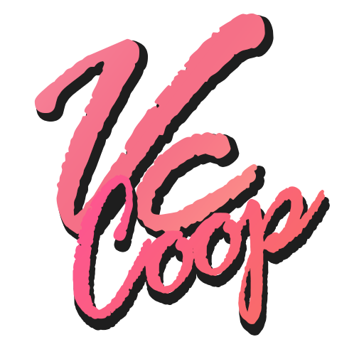

<p align="center">
  
</p>

<p align="center">
  <a href="https://store.rockstargames.com/fr/game/buy-grand-theft-auto-the-trilogy"></a>
</p>
<p align="center">
  <b>This mod needs a legitimately owned copy of Grand Theft Auto: Vice City.</b><br>
  <a href="https://store.rockstargames.com/fr/game/buy-grand-theft-auto-the-trilogy">Buy it on the Rockstar Store</a> (also on Steam). No game data is included here.
</p>

<p align="center">
  <a href="https://github.com/Parricidium/VCCoop/releases/latest"></a>
  <a href="https://ko-fi.com/parricidium"></a>
</p>

# VCCoop — the Vice City story in co-op, 2 to 4 players

A co-op mod for **Grand Theft Auto: Vice City** (PC, version 1.0). One player hosts and plays the
story; up to three friends join them in the same city and the same missions: same characters, cars,
cutscenes, texts, markers and timers, and their shots, punches and explosions count. Everything
outside the missions is shared too: traffic and pedestrians around the host, police, weather, money
and wanted level.

It also modernises the 2002 game, all optional: borderless widescreen at desktop resolution, a free
mouse camera in vehicles with GTA V-style aiming, longer draw distance, a custom menu look, and
**shared mods**: car and building models dropped in a folder are loaded by the game and sent to the
other players by themselves.

*[Version française plus bas.](#version-française)*

> You need your own copy of GTA Vice City (Steam, downgraded to 1.0). No game data is provided here.

---

## Contents

- [Download and install](#download-and-install)
- [Playing](#playing)
- [Features](#features)
- [Shared mods](#shared-mods)
- [Custom interface](#custom-interface)
- [Network](#network)
- [Known issues](#known-issues)
- [Building](#building)
- [Credits and license](#credits-and-license)
- [Version française](#version-française)

---

## Download and install

1. Every player needs GTA Vice City with `gta-vc.exe` in **version 1.0** (3 088 896 bytes). The
   Steam version must be downgraded with a community *downgrader*.
2. Download `VCCoop-<version>.zip` from the [releases](https://github.com/Parricidium/VCCoop/releases).
3. Unzip everything into the game's folder, next to `gta-vc.exe` (tip: make a copy of the game folder
   for co-op). The mod is a `dinput8.dll` proxy: nothing else in the game is modified.
4. Open `vccoop.ini` and set your nickname.

**Updating**: unzip the new version over the old one. Everybody must run the same version (the
network protocol is checked when joining).

Saves and settings of the co-op copy stay in the game folder (`SauvegardesLocales=1`), apart from your
solo game.

## Playing

Start `gta-vc.exe` normally. Main menu > **COOP**:

| | |
|---|---|
| **Host a game** | Opens the lobby with the list of connected players. **New game** or **Load a game**: the guests follow you by themselves (your save is sent to them). |
| **Join** | **Address** (the host's IP: Enter, type, Enter), then **Connect**. You wait in the lobby and enter the game when the host does. |
| **Nickname** | Your name, set before hosting or joining. |
| **Options** | **Coop options**: friendly fire, shared money, nicknames, keep weapons after death. **Video options**: draw distance (100 to 400 %), anti-aliasing (2x to 8x, taken at the next launch), anisotropic filtering, sun shadows. Video options are set here or in game with **Esc > COOP**; the host also has *Coop options* in the lobby and in game. |

`VCCoop - Heberger.cmd` / `VCCoop - Rejoindre.cmd` go straight to hosting / joining. Without COOP the
game stays single player. **Esc > COOP** in game shows the same page.

The host plays the missions as in single player. Guests are placed next to the host at the start and
the end of each story mission; "go there" and "get in that car" objectives can be completed by any
player, and guests see the destination markers.

### Keys

| Key | |
|---|---|
| **F** / **G** | Near another player's vehicle: take the first free seat (wheel or passenger) instead of jacking them, with the full animation. As a passenger, F or G to get out. |
| **F7** | Choose your outfit: Tommy, story characters, any pedestrian. Left / Right to browse, Enter to keep, Backspace to cancel. Kept for the next games; missions that dress Tommy override it for their duration. |
| **Tab** (held) | Player list: health, armour, ping, distance. |
| **B** | Put a meeting point where you look (seen by everybody, in your colour); B again to remove it. |
| **Mouse** (vehicle) | Orbits the camera around the vehicle (back behind after 2.5 s). **Right click** with a pistol or SMG: aim at the centre of the screen, left click fires — driver or passenger. The mouse no longer steers. `CameraLibre=0` for the original camera. |
| **Passenger** | Look left / right and shoot like the driver (pistols, SMGs). |

Each player has a colour (blue = host, orange, green, purple): a blip on the radar and the map, and
their nickname above their head (`AfficherPseudos=0` to hide).

## Features

- **The story in co-op**: missions run on the host and are mirrored to the guests — mission
  characters and vehicles, cutscenes, fades, camera, texts and help messages, radar blips and
  markers, pickups, objects (briefcases, bombs...), on-screen timers and counters, the area of the city
  or interior being shown. Story progress is sent to the guests as missions are passed, and a guest
  who joins later receives the host's save and the current state.
- **Combat**: player-vs-player damage (punches, bullets, cars, explosions) if friendly fire is on;
  bullets and punches on the host's characters count on the host; grenades, molotovs and rockets are
  replayed on every machine; other players' shots are visible, including drive-by.
- **Vehicles**: every vehicle driven by a player is shared — position and physics interpolated,
  steering, wheel spin, radio station of the driver, colours, visible damage (doors, panels, lights,
  tyres), wrecks. Players get in and out with the game's own animations, door included.
- **Shared world**: near the host (150 m) a guest sees the same pedestrians and traffic; farther
  away (210 m) they have their own city. Parked mission vehicles, pickups and shop icons are set up
  locally by each player.
- **Police**: shared wanted level; a guest's police is seen by the others and shoots for real; crimes
  committed by a guest on the host's pedestrians give stars.
- **Death**: a dead or busted guest reappears at the nearest hospital / police station, keeping
  weapons and money (`GarderArmes`), or next to the host (`ReapparitionHote=1`).
- **Side missions**: a guest can run taxi, ambulance, firefighter, vigilante and pizza missions on
  their side, in the right vehicle.
- **Reconnection**: a guest who loses the connection comes back by themselves, without reloading, and
  receives the full state again. A player who quits disappears at once on the other machines, with
  their vehicles.
- **Widescreen**: borderless fullscreen at desktop resolution by default, real aspect ratio (16:9,
  21:9, 32:9) with a wider field of view, HUD and menus in proportion (`Fenetre`, `GrandEcran`).
- **Video options** (all local, `0` = original rendering): draw distance (`DistanceAffichage`, 100 to
  400 %), anti-aliasing (`Anticrenelage`, MSAA 2x/4x/8x), anisotropic filtering 16x + trilinear
  (`FiltrageAnisotrope`), **sun shadows** (`OmbresSoleil`, `OmbresResolution` 4096 or 2048): a shadow map rendered from the sun every
  frame (250 m around the camera, grid snapped to its texels) and compared per pixel with 2 taps — buildings, palms, vehicles and characters cast real
  shadows that move with the time of day, foliage cut out by its texture. Done on the game's own Direct3D 8
  device with hand-assembled vs_1_1 / ps_1_4 shaders, so no wrapper and no extra DLL.
- **30 fps by default** (`ImagesParSeconde`): above 30 the original game misbehaves (vehicle entry).
- **ASI loader built in**: `.asi` mods from the game folder, `scripts\` and `plugins\` are loaded
  (`ChargerASI=0` to skip). Do not install the Ultimate ASI Loader (same `dinput8.dll` name).
- **Logs**: `vccoop.log` for the current game and one file per game in `logs\` (last 50).

## Shared mods

`ModsPartages=1` (default). Drop your mods in `VCCoop\mods\`, in any sub-folders you like — the
folder names are only there for you:

```
VCCoop\mods\my ferrari\cheetah.dff
VCCoop\mods\my ferrari\cheetah.txd
VCCoop\mods\my ferrari\handling.cfg
```

Only the file names matter:

- `name.dff` / `name.txd` (also `.col`, `.ifp`) replace the game's model `name`: a car, a weapon, a
  character or a building (`cheetah`, `infernus`, `colt45`...).
- `handling.cfg` (or `handling.txt`, `*.handling`): handling lines in Vice City's `handling.cfg`
  format; each line replaces the game's line that starts with the same vehicle name (`CHEETAH ...`).
- `carcols.dat`: colour lines (`cheetah, 1,1, 2,2 ...`), same rule.

How it works: at every game start a `vccmods.img` is built at the game's root from these files and
loaded with priority over `gta3.img`. The game's own files are never modified: empty the folder and
everything is back to stock. The host sends its folder to the guests automatically (TCP, same port as
the game); a guest only downloads what they miss, the lobby shows the progress and the game cannot
start until everybody is up to date. Guests load exactly the host's files, so everybody has the same
models.

Limits: replacements only (no new vehicle IDs), 64 MB per file, model file names of 23 characters
at most (extension included). GTA V `handling.xml` files are not Vice City's format: use the
`handling.cfg` line the mod author provides.

## Custom interface

- Menu text: near-black with a pink outline, smaller and sharper than the original (`StyleMenus`,
  `CouleurTexteMenus`, `CouleurContourMenus`, `CouleurSelectionMenus`, `TailleTexteMenus`); the save
  pages use white text on the background with a pink selection bar.
- Images in `VCCoop\interface\`: `fond_menu.png` (menu background, 1920×1080 or 2560×1440),
  `logo.png` (512×512, transparent), `chargement1.jpg`, `chargement2.jpg`... (loading screens,
  picked at random). Shown at their real size without stretching; see the folder's `LISEZMOI.txt`.

## Network

The host listens on **UDP 7790** (`Port` in `vccoop.ini`) and serves the shared mods on the same
port in **TCP**. Over the Internet the host forwards both on their router, or everybody uses a VPN
(Radmin VPN, ZeroTier, Hamachi). Guests set the host's address in the COOP menu.

## Known issues

Test build. A report with the `logs\` files of **both** players helps a lot.

1. **Vehicle damage caused by a non-owner** is approximate: the owner's state wins; fire is not
   synchronised.
2. **Passengers seen from the outside** are seated directly (once seated on their side): the game's
   AI refuses the passenger-entry animation towards a player-driven car. Drivers have the full
   animation.
3. **Followers (Lance...) follow the host**: for escort missions, travel together.
4. **A guest who reloaded their game a different number of times than the host** can, rarely, get a
   wrong script variable from a full sync (crash risk being investigated).
5. **Only the host plays story missions**; guests cannot start one.
6. **No kick and no password** for the lobby (by choice for now).
7. **Mods**: `.col` and `.ifp` replacements are untested; map additions (new buildings) and added
   vehicles are not supported.

## Building

Visual Studio 2022 Build Tools (x86, `/MT`), no other dependency: `build.cmd` compiles `src\*.cpp`
into `build\dinput8.dll`. `dist\make-release.ps1 -Version <v>` builds and packages the zip.
`run\` holds the two-instance test scripts (`run\make-testinstances.ps1` creates them under
`D:\Games\COOPTEST`); `re\` the Ghidra headless helpers used to read the game.

The game executable and any decompiled code are **not** in this repository.

## Credits and license

- Vice City 1.0 addresses: read with Ghidra, cross-checked with [plugin-sdk](https://github.com/DK22Pac/plugin-sdk)
  (DK22Pac).
- Grand Theft Auto and Vice City are trademarks of Rockstar Games / Take-Two Interactive. This is an
  unofficial, non-commercial fan project, not affiliated with them; you need your own copy of the game.
- License: not chosen yet (private repository).

If you enjoy it, you can [support me on Ko-fi](https://ko-fi.com/parricidium). ❤️

---

# Version française

Un mod coopératif pour **Grand Theft Auto: Vice City** (PC, version 1.0). Un joueur héberge et joue
l'histoire ; jusqu'à trois amis le rejoignent dans la même ville et les mêmes missions : mêmes
personnages, voitures, cinématiques, textes, marqueurs et minuteurs, et leurs tirs, coups et
explosions comptent. Hors mission aussi, tout est partagé : passants et circulation autour de l'hôte,
police, météo, argent et niveau de recherche.

Le mod modernise aussi le jeu de 2002, tout est optionnel : plein écran fenêtré à la résolution du
bureau, caméra libre à la souris en véhicule avec visée façon GTA V, distance d'affichage allongée,
menus personnalisés, et **mods partagés** : des modèles de voitures ou de bâtiments déposés dans un
dossier sont chargés par le jeu et envoyés tout seuls aux autres joueurs.

> Il faut posséder une copie légitime de GTA Vice City (rétrogradée en 1.0) : [l'acheter sur le Rockstar Store](https://store.rockstargames.com/fr/game/buy-grand-theft-auto-the-trilogy) (aussi sur Steam). Aucun fichier du jeu n'est fourni.

## Téléchargement et installation

1. Chaque joueur a besoin de GTA Vice City avec `gta-vc.exe` en **version 1.0** (3 088 896 octets).
   La version Steam se rétrograde avec un *downgrader* de la communauté.
2. Télécharger `VCCoop-<version>.zip` dans les [releases](https://github.com/Parricidium/VCCoop/releases).
3. Tout décompresser dans le dossier du jeu, à côté de `gta-vc.exe` (conseil : faire une copie du
   dossier du jeu pour la coop). Le mod est un `dinput8.dll` : rien d'autre n'est modifié.
4. Ouvrir `vccoop.ini` et mettre son pseudo.

**Mise à jour** : décompresser la nouvelle version par-dessus. Tout le monde doit avoir la même
version (vérifiée à la connexion). Les sauvegardes et réglages de la copie coop restent dans le
dossier du jeu (`SauvegardesLocales=1`), à part du solo.

## Jouer

Lancer `gta-vc.exe` normalement. Menu principal > **COOP** :

| | |
|---|---|
| **Créer une partie** | Ouvre le salon avec la liste des joueurs connectés. **Nouvelle partie** ou **Charger une partie** : les invités suivent tout seuls (la sauvegarde leur est envoyée). |
| **Rejoindre** | **Adresse** (IP de l'hôte : Entrée, taper, Entrée), puis **Se connecter**. On attend dans le salon et on entre en jeu avec l'hôte. |
| **Pseudo** | Votre nom, à régler avant de créer ou rejoindre. |
| **Options** | **Options coop** : tir ami, argent partagé, pseudos, garder ses armes après la mort. **Options vidéo** : distance d'affichage (100 à 400 %), anticrénelage (2x à 8x, pris au prochain lancement), filtrage anisotrope, ombres du soleil. Les options vidéo se règlent ici ou en jeu par **Échap > COOP** ; l'hôte a aussi *Options coop* dans le salon et en jeu. |

`VCCoop - Heberger.cmd` / `VCCoop - Rejoindre.cmd` vont droit à l'hébergement / la connexion. Sans
passer par COOP, le jeu reste en solo. **Échap > COOP** en jeu montre la même page.

L'hôte joue les missions comme en solo. Les invités sont posés à côté de lui au début et à la fin de
chaque mission d'histoire ; les objectifs « aller là », « monter dans cette voiture » peuvent être
remplis par n'importe quel joueur, et les invités voient les marqueurs de destination.

### Touches

| Touche | |
|---|---|
| **F** / **G** | Près du véhicule d'un autre joueur : prendre la première place libre (volant ou passager) au lieu de le lui voler, avec l'animation complète. Passager, F ou G pour descendre. |
| **F7** | Choisir sa tenue : Tommy, personnages de l'histoire, n'importe quel passant. Gauche / Droite pour parcourir, Entrée pour garder, Retour pour annuler. Gardée pour les parties suivantes ; les missions qui habillent Tommy la remplacent le temps de la mission. |
| **Tab** (maintenu) | Liste des joueurs : santé, gilet, ping, distance. |
| **B** | Poser un point de rendez-vous là où on regarde (vu de tous, dans sa couleur) ; B à nouveau pour le retirer. |
| **Souris** (véhicule) | Fait tourner la caméra autour du véhicule (retour derrière au bout de 2,5 s). **Clic droit** avec un pistolet ou une mitraillette : visée au centre de l'écran, clic gauche pour tirer, conducteur comme passager. La souris ne dirige plus la voiture. `CameraLibre=0` pour la caméra d'origine. |
| **Passager** | Regarder à gauche / à droite et tirer comme le conducteur (pistolets, mitraillettes). |

Chaque joueur a sa couleur (bleu = hôte, orange, vert, violet) : un point sur le radar et la carte, et
son pseudo au-dessus de la tête (`AfficherPseudos=0` pour le cacher).

## Fonctionnalités

- **L'histoire en coop** : les missions tournent chez l'hôte et sont reproduites chez les invités :
  personnages et véhicules de mission, cinématiques, fondus, caméra, textes et messages d'aide,
  marqueurs radar, pickups, objets (mallettes, bombes...), minuteurs et compteurs à l'écran, zone
  affichée (ville ou intérieur). L'avancement de l'histoire part aux invités au fil des missions ; un
  invité qui arrive plus tard reçoit la sauvegarde de l'hôte et l'état courant.
- **Combat** : dégâts entre joueurs (coups, balles, voitures, explosions) si le tir ami est activé ;
  balles et coups sur les personnages de l'hôte comptent chez lui ; grenades, cocktails et roquettes
  rejoués chez tout le monde ; tirs des autres joueurs visibles, drive-by compris.
- **Véhicules** : tout véhicule conduit par un joueur est partagé : position et physique
  interpolées, volant, rotation des roues, station de radio du conducteur, couleurs, dégâts visibles
  (portes, panneaux, phares, pneus), épaves. Montée et descente avec les animations du jeu, portière
  comprise.
- **Monde partagé** : près de l'hôte (150 m) un invité voit les mêmes passants et la même
  circulation ; plus loin (210 m) il retrouve sa propre ville. Véhicules garés de mission, pickups et
  icônes des boutiques sont posés en local chez chacun.
- **Police** : niveau de recherche commun ; la police d'un invité est vue par les autres et tire pour
  de vrai ; les crimes d'un invité sur les passants de l'hôte donnent des étoiles.
- **Mort** : un invité mort ou arrêté réapparaît à l'hôpital / au commissariat le plus proche, avec ses
  armes et son argent (`GarderArmes`), ou près de l'hôte (`ReapparitionHote=1`).
- **Missions secondaires** : un invité peut jouer taxi, ambulance, pompiers, justicier et pizzas de son
  côté, dans le bon véhicule.
- **Reconnexion** : un invité qui perd la connexion revient tout seul, sans recharger, et reçoit à
  nouveau l'état complet. Un joueur qui quitte disparaît tout de suite chez les autres, avec ses
  véhicules.
- **Grand écran** : plein écran fenêtré à la résolution du bureau par défaut, vrai format (16:9,
  21:9, 32:9) avec un champ de vision élargi, HUD et menus en proportion (`Fenetre`, `GrandEcran`).
- **Options vidéo** (toutes locales, `0` = rendu d'origine) : distance d'affichage
  (`DistanceAffichage`, 100 à 400 %), anticrénelage (`Anticrenelage`, MSAA 2x/4x/8x), filtrage
  anisotrope 16x + trilinéaire (`FiltrageAnisotrope`), **ombres du soleil** (`OmbresSoleil`, `OmbresResolution` 4096 ou 2048) : une carte
  d'ombre rendue depuis le soleil à chaque image (250 m autour de la caméra, grille alignée sur ses texels) et
  comparée par pixel avec 2 échantillons ;
  bâtiments, palmiers, véhicules et personnages projettent de vraies ombres qui suivent l'heure, feuillages
  découpés par leur texture. Fait sur le périphérique Direct3D 8 du jeu avec des shaders vs_1_1 / ps_1_4
  assemblés à la main : ni wrapper, ni DLL supplémentaire.
- **30 images/s par défaut** (`ImagesParSeconde`) : au-dessus, le jeu d'origine a des bogues (montée
  en véhicule).
- **Chargeur ASI intégré** : les mods `.asi` du dossier du jeu, de `scripts\` et de `plugins\` sont
  chargés (`ChargerASI=0` pour ne pas les charger). Ne pas installer l'Ultimate ASI Loader (même nom
  `dinput8.dll`).
- **Journaux** : `vccoop.log` pour la partie en cours et un fichier par partie dans `logs\` (50
  derniers).

## Mods partagés

`ModsPartages=1` (par défaut). Déposez vos mods dans `VCCoop\mods\`, dans les sous-dossiers que vous
voulez — leur nom ne sert qu'à vous y retrouver :

```
VCCoop\mods\ma ferrari\cheetah.dff
VCCoop\mods\ma ferrari\cheetah.txd
VCCoop\mods\ma ferrari\handling.cfg
```

Seul le nom des fichiers compte :

- `nom.dff` / `nom.txd` (et `.col`, `.ifp`) remplacent le modèle `nom` du jeu : voiture, arme,
  personnage ou bâtiment (`cheetah`, `infernus`, `colt45`...).
- `handling.cfg` (ou `handling.txt`, `*.handling`) : lignes de conduite au format du `handling.cfg`
  de Vice City ; chaque ligne remplace celle du jeu qui commence par le même nom de véhicule
  (`CHEETAH ...`).
- `carcols.dat` : lignes de couleurs (`cheetah, 1,1, 2,2 ...`), même règle.

Fonctionnement : à chaque lancement de partie, un `vccmods.img` est fabriqué à la racine du jeu à
partir de ces fichiers et chargé en priorité sur `gta3.img`. Les fichiers du jeu ne sont jamais
modifiés : videz le dossier et tout redevient d'origine. L'hôte envoie son dossier aux invités tout
seul (TCP, même port que la partie) ; un invité ne télécharge que ce qui lui manque, le salon montre
la progression et la partie ne peut pas démarrer tant que tout le monde n'est pas à jour. Les invités
chargent exactement les fichiers de l'hôte : tout le monde a les mêmes modèles.

Limites : remplacements seulement (pas de nouveaux identifiants de véhicule), 64 Mo par fichier,
noms de fichiers de modèle de 23 caractères au plus (extension comprise). Les `handling.xml` de GTA V
ne sont pas au format de Vice City : prendre la ligne `handling.cfg` fournie par l'auteur du mod.

## Interface personnalisée

- Texte des menus : presque noir à contour rose, plus petit et plus net que l'original
  (`StyleMenus`, `CouleurTexteMenus`, `CouleurContourMenus`, `CouleurSelectionMenus`,
  `TailleTexteMenus`) ; les pages de sauvegardes ont un texte blanc sur le fond et une barre de
  sélection rose.
- Images dans `VCCoop\interface\` : `fond_menu.png` (fond des menus, 1920×1080 ou 2560×1440),
  `logo.png` (512×512, transparent), `chargement1.jpg`, `chargement2.jpg`... (écrans de chargement,
  tirés au hasard). Affichées à leur vraie taille sans déformation ; voir le `LISEZMOI.txt` du dossier.

## Réseau

L'hôte écoute sur **UDP 7790** (`Port` dans `vccoop.ini`) et sert les mods partagés sur le même port
en **TCP**. Par Internet, l'hôte ouvre les deux sur sa box, ou tout le monde passe par un VPN (Radmin
VPN, ZeroTier, Hamachi). Les invités règlent l'adresse de l'hôte dans le menu COOP.

## Bugs connus

Version de test. Un rapport avec les fichiers `logs\` des **deux** joueurs aide beaucoup.

1. **Dégâts de véhicule faits par un non-propriétaire** : approximatifs, l'état du propriétaire
   l'emporte ; le feu n'est pas synchronisé.
2. **Passagers vus de l'extérieur** : posés directement sur le siège (une fois assis chez eux) ;
   l'IA du jeu refuse l'animation d'entrée en passager vers une voiture conduite par un joueur. Les
   conducteurs ont l'animation complète.
3. **Les personnages qui suivent (Lance...) suivent l'hôte** : pour ces missions, venez ensemble.
4. **Un invité qui a rechargé sa partie un nombre de fois différent de l'hôte** peut, rarement,
   recevoir une mauvaise variable de script lors d'une synchro complète (risque de plantage à
   l'étude).
5. **Seul l'hôte lance les missions d'histoire.**
6. **Pas de kick ni de mot de passe** pour le salon (choix, pour l'instant).
7. **Mods** : remplacements `.col` et `.ifp` non testés ; ajouts de carte (nouveaux bâtiments) et
   véhicules ajoutés non pris en charge.

## Compiler

Visual Studio 2022 Build Tools (x86, `/MT`), aucune autre dépendance : `build.cmd` compile
`src\*.cpp` en `build\dinput8.dll`. `dist\make-release.ps1 -Version <v>` compile et assemble le zip.
`run\` contient les scripts de test à deux instances (`run\make-testinstances.ps1` les crée sous
`D:\Games\COOPTEST`) ; `re\` les outils Ghidra en ligne de commande qui ont servi à lire le jeu.

L'exécutable du jeu et tout code décompilé ne sont **pas** dans ce dépôt.

## Crédits et licence

- Adresses de Vice City 1.0 : lues avec Ghidra, recoupées avec [plugin-sdk](https://github.com/DK22Pac/plugin-sdk)
  (DK22Pac).
- Grand Theft Auto et Vice City sont des marques de Rockstar Games / Take-Two Interactive. Projet de
  fan, non officiel, non commercial, sans lien avec eux ; il faut posséder le jeu.
- Licence : pas encore choisie (dépôt privé).

Si le mod vous plaît, vous pouvez [me soutenir sur Ko-fi](https://ko-fi.com/parricidium). ❤️
